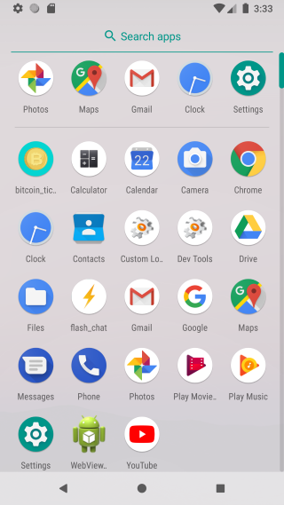
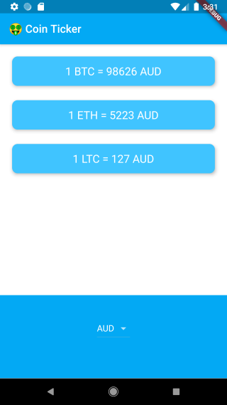
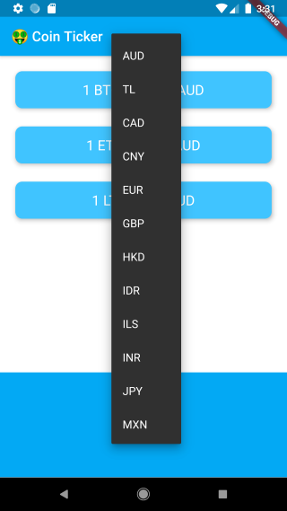
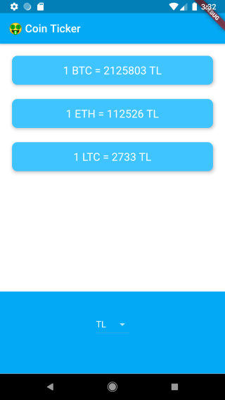

# Bitcoin Ticker

## Goal

The objective of this project is to learn about using Cupertino and Material Widgets in parallel and providing a different user interface depending on the platform.

## Screenshots

We’re going to make a crypto currency price checking app. 

## Key concepts shown in this section are

- DropdownButton Widget from Material design.
- Loop through code using Dart for and for-in loops.
- Cupertino Widgets in app.
- Check the platform your app is being run on to customise the UI for that platform.
